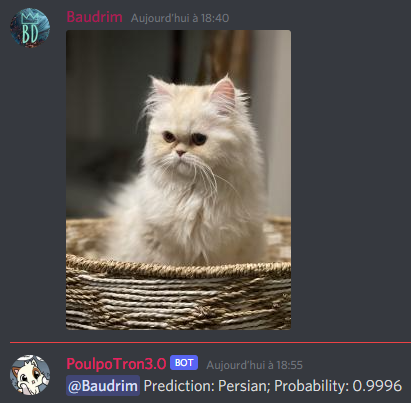

# What-the-cat

Ce projet est bot discord permettant de trouver la race d'un chat a partir d'une photo envoyé sur un salon discord avec l'aide de FastAI.

Ex: 



# Comment le faire fonctionner ?

- Ouvrir "wtc fastai.ipynb"
- Avoir un environnement pour faire fonctionner un Notebook
- Installer le requirements.txt
- Créer un fichier 'discord_param.py' dans la racine avec à l'intérieur :
```python
discord_token = 'VOTRE TOKEN DISCORD'
```

Si vous voulez faire le fitting, il faut exécuter toutes les cellules jusqu'au texte: "Début du bot Discord"

Si vous voulez faire tourner le bot, il faut éxecuter la cellule en dessous du texte et changer l'id du salon ici:

```python
channel = client.get_channel(VOTRE SALON)
```

Pour éteindre le bot, il faut éxecuter la dernière cellule.